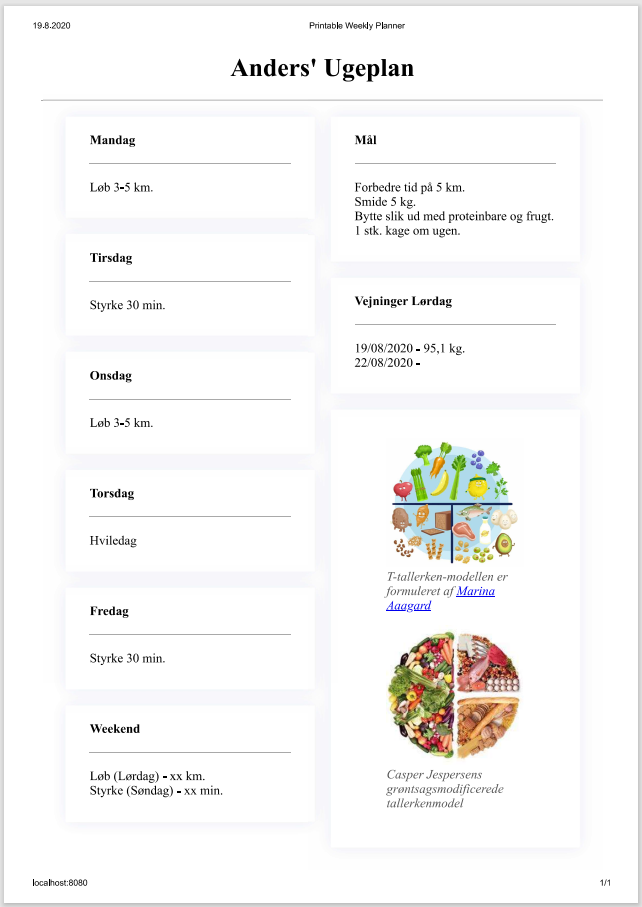

# printable-weekly-planner

A printable weekly planner made with 11ty.

## Requirements

LTS version of [Node.js](https://nodejs.org/en/).

## Setup

1. Run `npm ci` in a console of your choice
2. Run `npm start`
3. Open [http://localhost:8080/](http://localhost:8080/) in a browser of your choice
4. (optional) Edit the data in _data/weekplan.json

## Example

